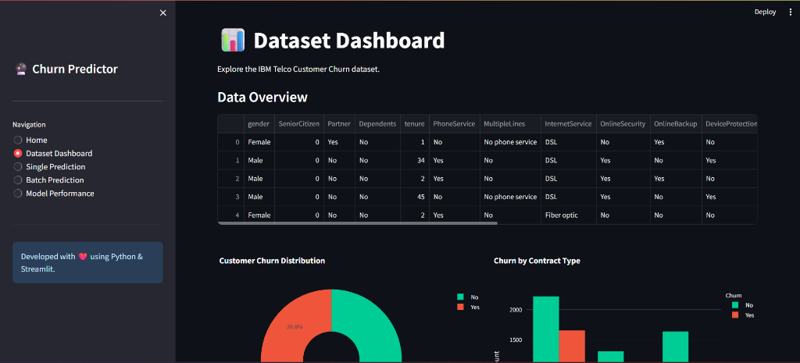
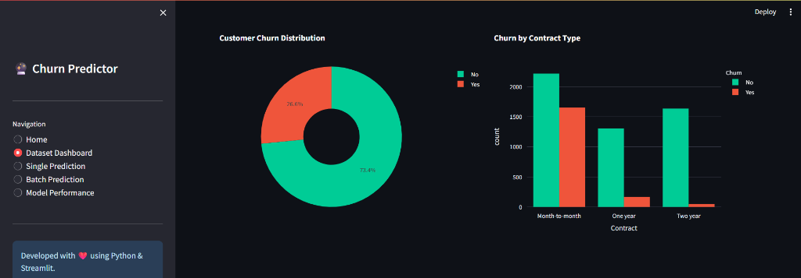
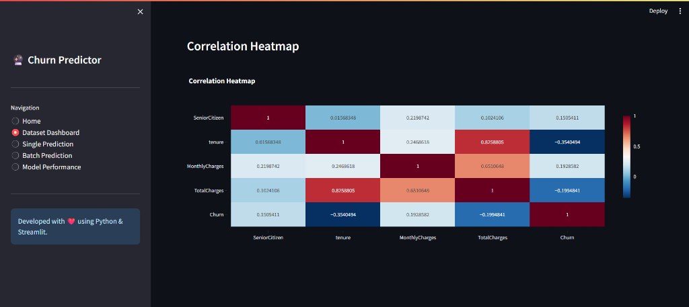
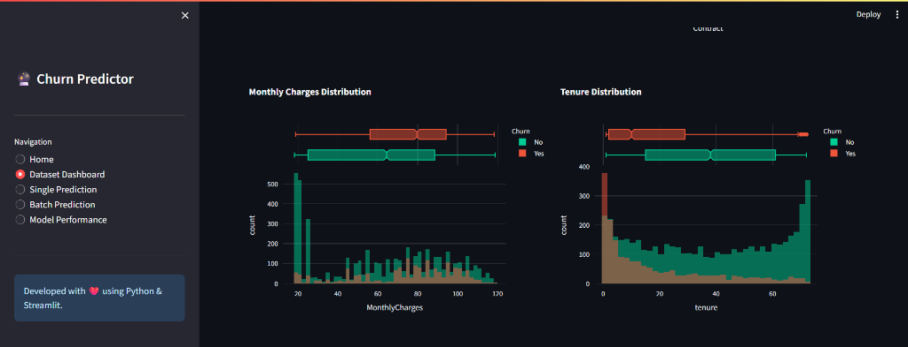
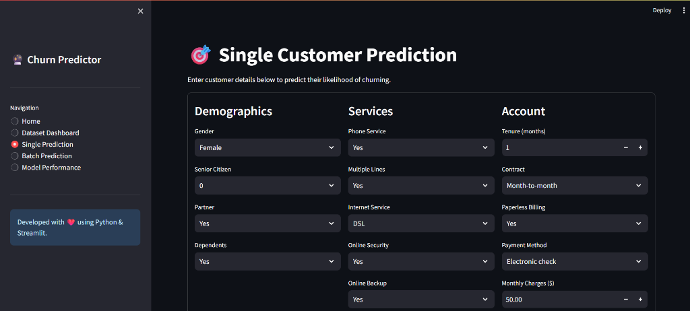
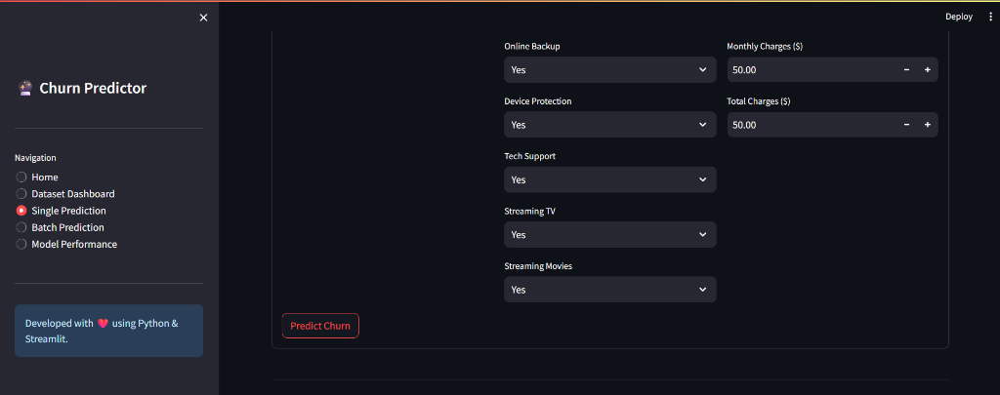
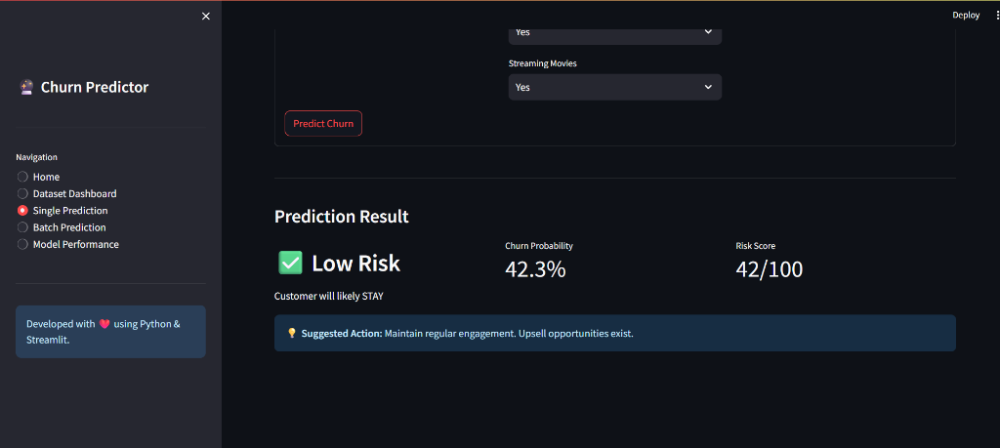
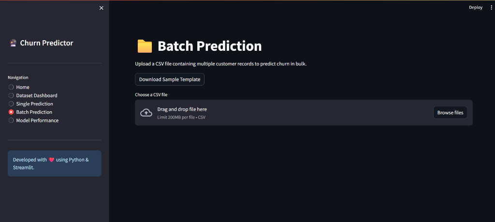

# ChurnIQ 🚀
**AI-Powered Customer Retention Intelligence Platform**
[](https://ayushkumarjha1-customer-churn-prediction-app-axgcxh.streamlit.app/)


ChurnIQ is a premium B2B SaaS application that uses machine learning and explainable AI to identify customers at risk of leaving and turns predictions into actionable retention strategies.

## 🌟 Features
- **Predictive Analytics:** Uses a highly accurate Gradient Boosting model to estimate churn probability.
- **Explainable AI (SHAP):** Understand *why* a customer is at risk with feature importance breakdowns.
- **Customer Intelligence:** Searchable, filterable dashboard of your customer base.
- **Retention Simulator:** Interactive "What If" scenarios to estimate retained revenue after intervention.
- **AI Copilot:** Dedicated assistant for customer health queries and retention strategy generation.

## 🏗️ Architecture
ChurnIQ is built on a modern, decoupled SaaS architecture:
- **Frontend:** Next.js (React), Tailwind CSS, TypeScript.
- **Backend:** FastAPI (Python), SQLAlchemy (SQLite).
- **Machine Learning:** Scikit-Learn, pandas, NumPy, SHAP, Joblib.


## 📸 Project Dashboards & Visualizations

### 1. Main Dashboard


### 2. Dataset Analytics & Insights





### 3. Customer Prediction UI




### 4. Batch Prediction


### 5. ML Evaluation Metrics


## 🚀 Getting Started

### 1. Start the FastAPI Backend
```bash
cd backend
pip install -r requirements.txt
uvicorn main:app --reload --port 8000
```
API runs on `http://localhost:8000`

### 2. Start the Next.js Frontend
```bash
cd frontend
npm install
npm run dev
```
UI runs on `http://localhost:3000`

## 🧠 Machine Learning Pipeline
The ML pipeline uses the IBM Telco dataset. It automatically preprocesses categorical and numerical features, scales them, and scores them using a pre-trained Gradient Boosting Classifier. It integrates SHAP (SHapley Additive exPlanations) to provide local interpretability.

## 🔒 Security
- CORS configured for frontend origins.
- ML models loaded securely via Joblib.
- API keys for Copilot must be injected via `.env`.

---
*Built as a flagship AI SaaS portfolio project.*
