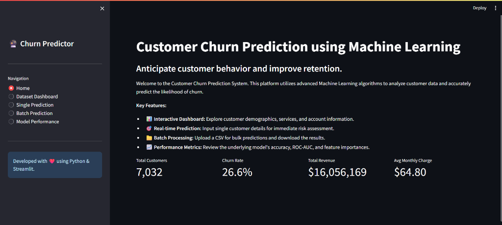
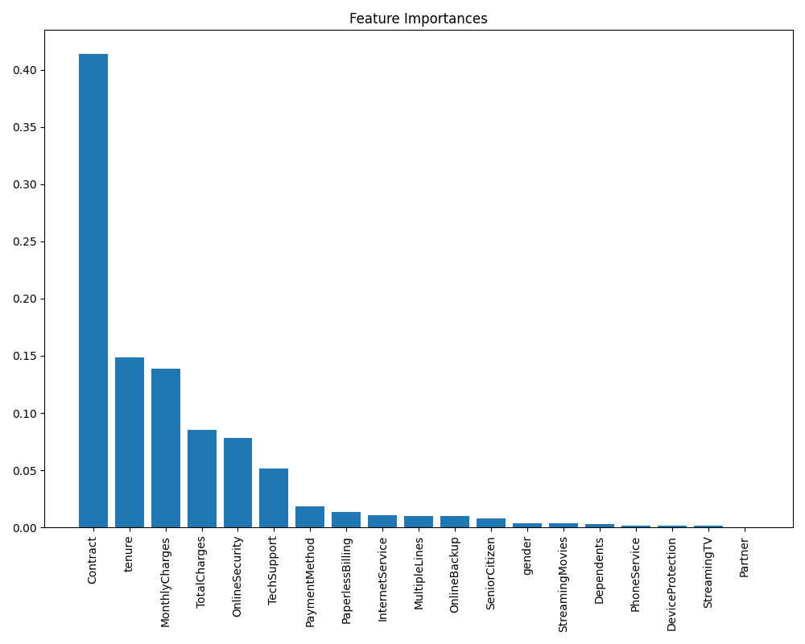
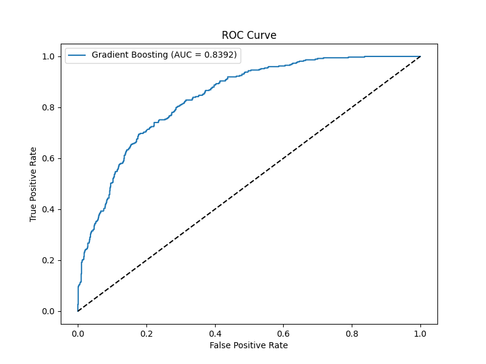
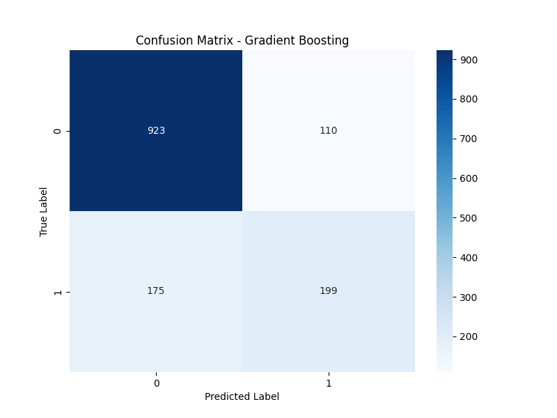

# Customer Churn Prediction System 🔮


A complete, production-ready Machine Learning system to predict customer churn using the IBM Telco Customer Churn dataset. Built with Python, Scikit-Learn, and a modern Streamlit dashboard.

## 🌟 Features

- **Automated ML Pipeline:** End-to-end data preprocessing, scaling, and encoding.
- **Model Comparison:** Automatically trains and compares Logistic Regression, Random Forest, SVM, Gradient Boosting, etc., selecting the best model based on ROC-AUC.
- **Interactive Dashboard:** Beautiful, responsive Streamlit UI with custom CSS.
- **Data Exploration:** Rich Plotly visualizations for exploratory data analysis (EDA).
- **Real-time Predictions:** Input customer data via form for instant risk assessment.
- **Batch Processing:** Upload CSV files to predict churn for multiple customers at once.

## 🚀 Installation

1. **Clone the repository** (if on GitHub):
   ```bash
   git clone https://github.com/yourusername/Customer-Churn-Prediction.git
   cd Customer-Churn-Prediction
   ```

2. **Install dependencies:**
   ```bash
   pip install -r requirements.txt
   ```

## 🧠 Usage

1. **Train the Model:**
   This will download the dataset automatically (if missing), preprocess it, train 6 different ML algorithms, evaluate them, save the best one, and generate evaluation plots.
   ```bash
   python train_model.py
   ```

2. **Launch the Dashboard:**
   Start the interactive Streamlit application.
   ```bash
   streamlit run app.py
   ```

## 📸 Dashboard Screenshots

*(Note: Replace the images in the `images/` folder with your actual dashboard screenshots to make them appear here!)*

**Home & Overview Dashboard**


**Interactive Predictions**


---

## 📊 Model Performance Highlights

Here are the evaluation plots generated automatically by our best-performing model (Gradient Boosting):

### 1. Feature Importance
This chart reveals the most critical factors influencing whether a customer will churn or stay.


### 2. Receiver Operating Characteristic (ROC) Curve
Demonstrates the high predictive accuracy (AUC) of the chosen model.


### 3. Confusion Matrix
Visual breakdown of the model's True Positives, True Negatives, False Positives, and False Negatives.


## 📁 Project Structure

```
Customer-Churn-Prediction/
├── app.py                 # Streamlit main application
├── train_model.py         # ML training pipeline script
├── predict.py             # Inference logic for single/batch
├── requirements.txt       # Project dependencies
├── utils/                 # Helper modules
│   ├── preprocessing.py   # Data cleaning and encoding
│   ├── visualization.py   # Plotly chart generators
│   └── helpers.py         # CSS loading, dataset downloader
├── model/                 # Saved models and encoders
├── dataset/               # CSV datasets
├── images/                # Generated performance plots
└── assets/                # UI assets (CSS, logo)
```

## ☁️ Deployment

### Streamlit Community Cloud
1. Push this repository to GitHub.
2. Go to [share.streamlit.io](https://share.streamlit.io).
3. Click "New app", select your repository, branch, and set the main file path to `app.py`.
4. Click "Deploy".

## 📜 License
This project is licensed under the MIT License - see the LICENSE file for details.

